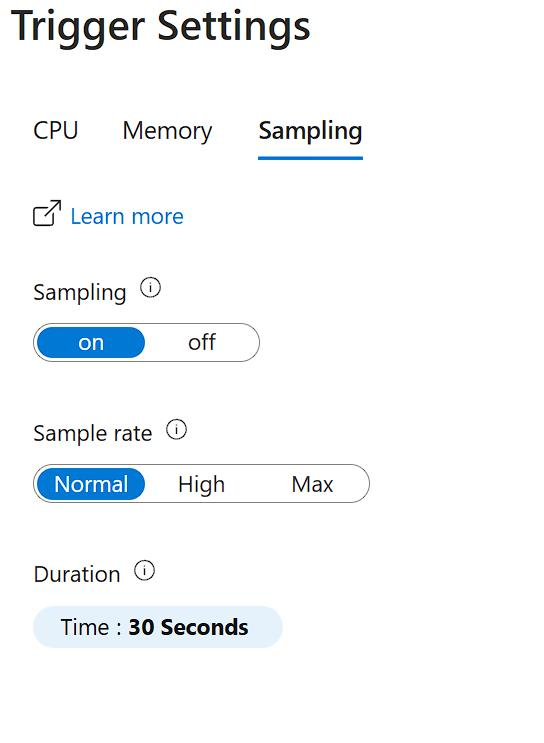
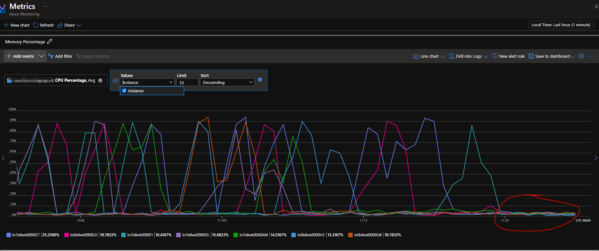
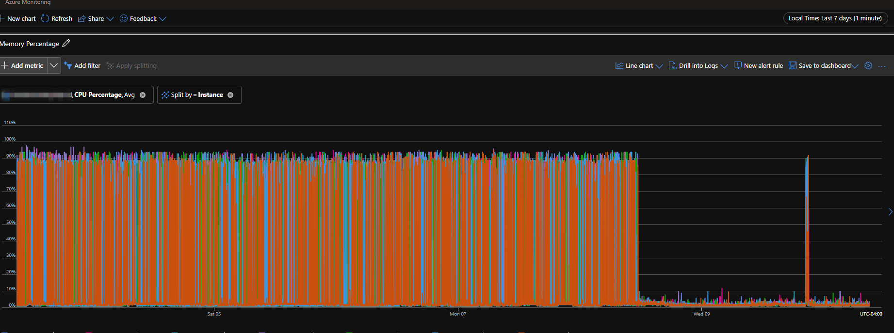

Have you ever track and debug a Heisenbug? It's elusive bug that disappear when you try to find it. But how about the opposite of Heisenbug, the one that tracking the bug actually causes it?

I've seen one. I was puzzled by one.

And I'm happy to say that I conquered one. Today's story is about that bug.

Once upon a time, not long ago, I was asked for help by a colleague as one of our customers has high CPU with their app service. Just another day at work, another problem to solve, so, well.

Looking at their profiler traces, it became evident that the high CPU is caused by frequent Gen 2 GC. In those memory dumps, there were usually 3 Gen 2 GC. More interesting, the reason for those garbage collection is `Induced`.

Which means some code explicitly calls `GC.Collect(2)`. But where?

I asked my colleague to confirm with the partner, who came back and said no, we do not use it. Then who? 

We call it in our memory compactor, but this is definitely not when the cache is cleared and compacted, and not this often.

As usual, a seemingly simple problem turned into a headache. I even built a program that use reflection the entire deployment package looking for places that call `GC.Collect(2)` explicitly, to make sure it was not overlooked by me, or the partner. I found none.

Then what could it be?

This kind of problem is one of the reasons I have lost so many hairs over the years. 

The realization 

The profiler is set up to trigger 

Of course, the immediate action is to disable auto triggering profiler. The long term action is to update to a newer version of Microsoft.ApplicationInsights.Profiler.AspNetCore.

Let's the end result speak for itself, this is the Gen 2 GC before and after disabling the profiler. After 30 minutes

And a few days later, the difference was ... strong.

Note that, one Gen 2 GC daily is fine.

