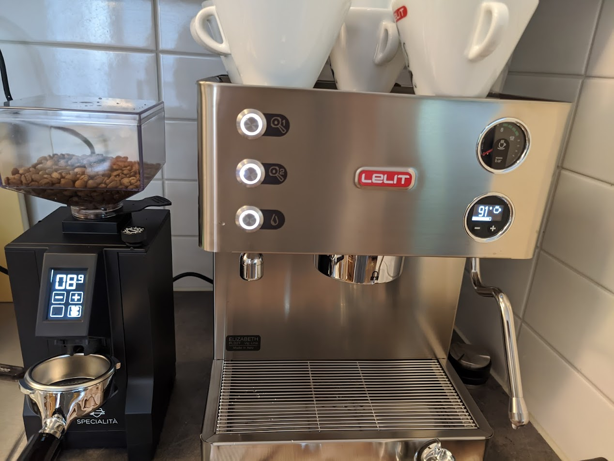

It all started 5 years ago.

Even though I was born and raised in a country famous with coffee production, I was not really fond of it. My first coffee memory was with my dad. Growing poor, like many other of our neighbors in early 90 (and we were even amongst poorest in the neighborhood), coffee was a luxury, it was not something you took for granted. My dad was gifted by someone with a bag of coffee, and he stashed it away for most of the year. It's a treat on Tết holiday, a "Vietnamese phin" style. It smelled lovely, but also very bitter. But with a lot of sugar, it's drinkable. I was able to taste some, and while it's not something I really enjoyed, it becomes a Tết memory.

Fast forward 20 years. No I had become a graduate working as a software engineer, almost adult. Still did not like coffee. If I went to a cafe I always ordered something sweet, either yohurt or smoothie. Coffee was never in my interest, too bitter anyway. The first proper coffee I had was around 2016 after I have moved to Sweden. There was a fancy portafilter machine at the office, I did not even remember the brand, but it was all stainless steel with a Handmade in Fienze proudly plated in the front. A colleague made me a latte, and that was the best coffee I had. He showed me the steps to do it, but of course it was too complicated for me to follow, so that's it. The machine later broken down and some of the service men came to the office and tried to repair it, apparently unsuccessfully, and they took it away. There is another typical super automatic coffee machine, like with any other office, but I rarely used that anyway.

Fast forward a few more years. 2020. Covid. Everybody stayed at home. Then one day a friend of mine posted a photo on facebook showing his new coffee mechine - Philips Latte To Go 2200 if I remember correctly. I saw that and thought to myself, oh, this could be nice. So I went into research mode to look for a machine to buy, and one thing led to another, I decided on a portafilter machine. On the prime days that happened October 2020, I bought a Sage Barista Pro from Amazon Germany.

I am now an owner of a coffee machine.

  

It was fun at the time, 

but I realized I was quickly outgrowing the machine. The machine was difficult to dial, you can't easily adjust the grinder to grind as fine or coarse as you would like. The machine only has only 5 settings for temperature. Being a thermojet machine, Sage advertises it as being ready in 3 seconds, but the grouphead and portafilter require much longer to heat up, and that can result in a very sour espressos. You need to pull a few empty shots just ot water to heat them up. It can make decent latte with the right skills, but it lacks something crucial for the new beginners - repeatablity and reliability. People usually tout it as a good beginner machine, so you can learn the art of pulling espressos and making latte art, but I see the way around. If you are skilled enough you can get by with it, but if you want to further advance in your coffee adventure, it will quickly become your bottleneck.

That was the case with me, so after less than one year with Sage, I decided to upgrade. After much research - again, it is decided that I will go with Lelit Elizabeth and Eureka Mignon Specialita.

Let me get straight to the point, this is the combination I like a lot, and wholeheartedly recommend it to anyone who wants something that high quality, affordable and last a long time. Yes it is not cheap, but if you want to buy once, cry once, this is pretty much it.

  

But for me, it's not about crying once.

