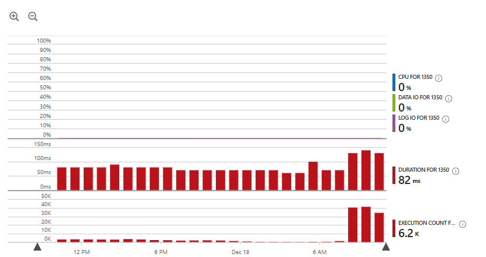
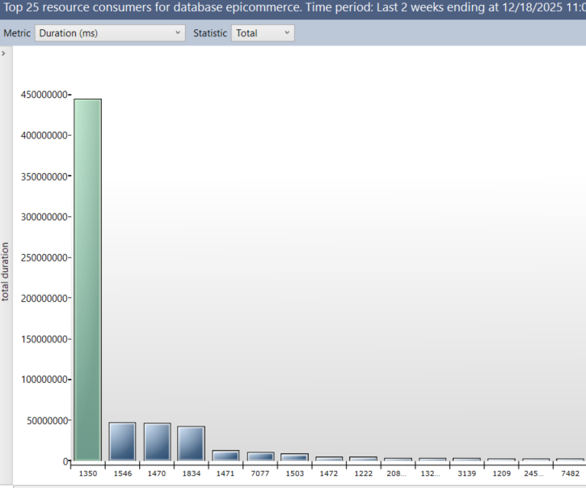
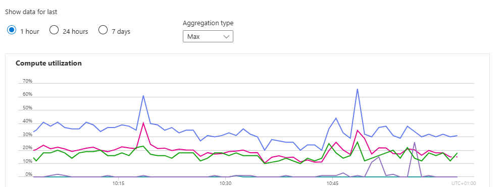
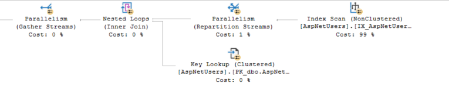

For most developers, the usage of AspNetUsers ends with the APIs - you use the API to create, update, query and delete users - and that's it. Performance is usually an afterthought, if at all. It's an official library from Microsoft, it must have good performance, right? I wish I could say, right. As with case of ASPNET Membership (are you old enough to remember it?), this has many performance gotchas. And it can be a huge problem with your website once the number of users have grown enough.


```
(@__normalizedUserName_0 nvarchar(256))SELECT TOP(1) [a].[Id], [a].[AccessFailedCount], [a].[Comment], [a].[ConcurrencyStamp], [a].[CreationDate], [a].[Email], [a].[EmailConfirmed], [a].[IsApproved], [a].[IsLockedOut], [a].[LastLockoutDate], [a].[LastLoginDate], [a].[LockoutEnabled], [a].[LockoutEnd], [a].[NormalizedEmail], [a].[NormalizedUserName], [a].[PasswordHash], [a].[PhoneNumber], [a].[PhoneNumberConfirmed], [a].[SecurityStamp], [a].[SiteId], [a].[TwoFactorEnabled], [a].[UserName]
FROM [AspNetUsers] AS [a]
WHERE [a].[NormalizedUserName] = @__normalizedUserName_0
```

Note that this is already a "better" API, as we are using normalized user name, so you avoid problem with casing - which could be very difficult to solve. It is a very simple query, as this is only selecting `TOP 1`, and we match the rows based on one column, it should have fast performance, right? No, it is not



And that query is single-handedly responsible for high usage of the database, 



and it's 32 vCores, no less



The reason is simple - a non clustered index is missing on `NormalizedUserName`. Adding it would make a huge difference on the specific query, the overall database usage, and therefore, performance. The problem runs deeper, there was a custom index on this column. However, it's `(SiteId, NormalizedUserName)`, and `SiteId` has very bad cardinality, causing a full scan on that index. 




The moral of this story - never assume that an API you use has adaquate, let alone, good performance. Always check your CPU, Memory and database usage to see if they are higher than they should be. Database queries are particularly easy to spot - we have Query Store which is extremely helpful in identifying bad queries.

On a technical level, the order of columns in an index is important, having a bad index could be worse than having no index at all.

And in particular, AspNetIdentity has been causing a lot of performance problems, so make sure to keep an eye on it.


